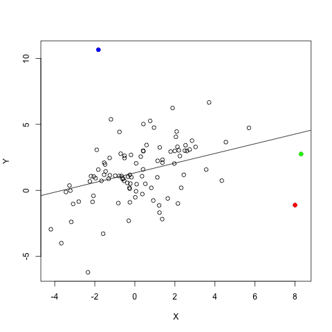

**Created on:** 11/10/2020

**Modified on:** `r format(Sys.time(), '%m/%d/%Y')`

```{r setup, include=FALSE}
knitr::opts_chunk$set(echo = TRUE, message = FALSE, warning = FALSE)

# Author: Tong Jin
# Affiliation: New York University
# Contact: tj1061@nyu.edu
```

# Part 1

## Question 1

The regression output contains the results of T-test about the regression coefficients.

For coefficient of `mheight`, what are the null and alternative hypotheses tested here?

Below we use $\beta_1$ to represent the regression coefficient for `mheight`.


A. $H_0$: $\beta_1$ = 0 versus $H_1$: $\beta_1$ = 1.

B. $H_0$: $\beta_1$ = 0 versus $H_1$: $\beta_1$ not equal to 0.

C. $H_0$: $\beta_1$ = 0 versus $H_1$: $\beta_1$ > 0	

D. $H_0$: $\beta_1$ = 1 versus $H_1$: $\beta_1$ = 0

```{r load data}
# Load the dataset `parent_son.csv` to R using read.csv(), 
# define the dataset as `dat`.
dat <- read.csv("../data/parent_son.csv")

# Check the structure of `dat`
str(dat)
```

### Answer: Q1

$H_0$: $\beta_1$ = 0.

$H_1$: $\beta_1$ not equal to 0. 

<br>

## Question 2

Based on the regression result, we can conclude that, at significance level 5%, son's height is statistically significantly related to mother's height.

### Answer: Q2

This is true because p-value is smaller than 0.05.

<br>

## Question 3

Now let's consider a different hypothesis testing problem.

Hypothetically suppose that, on average, sons perfectly inherit mother's height gene (but not their father's); that the average height of sons born to mother's of the same height is expected to be the same.

In this case, we can hypothesize the slope coefficient to be 1. The hypotheses to be tested will then be:

$H_0$: $\beta_1$ = 1; $H_a$: $\beta_1$ not equal to 1.

Calculate the test statistic (T-test) that tests such hypotheses using this formula: 

$$
T = \frac{\hat{\beta_1} - \beta_1 (\text{hypothesize value})}{SE(\hat{\beta_1})}
$$

### Answer: Q3

```{r Q3}
beta1 <- 0.32566
beta1_hypo <- 1
se_beta1 <- 0.01197
(T_Q3 <- (beta1 - beta1_hypo) / se_beta1)
```

Test statistic is -56.34.

<br>

## Question 4

What's the p-value for this test? (Sample size n = 1058)

**Hint:** you can compute the probability under the curve in R using `pt(T, n - 2)`. This function gives you the probability that P(t<T) under t distribution with degrees of freedom $n - 2$.

To get the correct p-value for a two-sided test, you need to twice this probability.

The p-value for this test is: ____ (round to three digits after decimal point (1 thousandth). 

If the answer is less than 0.001, put 0)

### Answer: Q4

```{r Q4}
n <- 1058
pt(T_Q3, n - 2) * 2
```

The p-value is 0.

<br>

# Part 2 - Regression Diagnostics

## Question 1



The scatter plot between X and Y is shown in this figure, together with a fitted regression line. Examine the three colored dots (red, green and blue dots) and match them with their characteristics.

A.	an outlier along the Y but not along the X

B.	an outlier along the X but not along the Y

C.	an outlier along both the Y and the X

### Answer: P2Q1

Outlier along the x axis only: green dot

Outlier along the y axis only: blue dot

Outlier along both axes: red dot

```{r P2Q1, echo = FALSE}
# Visualize outlier
set.seed(111)

n <- 100
x <- rnorm(n, mean = 0, sd = 2)
error <- rnorm(n, mean = 0, sd = 5)
y <- x + error
dat_Q5 <- data.frame(x, y)
mod_Q5 <- lm(y ~ x, data = dat_Q5)

par(mfrow = c(1, 2))
plot(x, y, pch = 1, col = "gray", xlim = c(-6, 10), ylim = c(-15, 20))
title(main = "Outlier along X only", cex = 0.8)
abline(a = 0.86525, b = -0.08779, lwd = 1.5, col = "red")
abline(a = 10, b = -0.08779, lty = "dashed", col = "red")
abline(a = -8, b = -0.08779, lty = "dashed", col = "red")
abline(v = -4, lty = "dashed", col = "red")
abline(v = 4, lty = "dashed", col = "red")
points(x = 8, y = -5, pch = 16, col = "green")
points(x = 10, y = 6, pch = 16, col = "green")

plot(x, y, pch = 1, col = "gray", xlim = c(-6, 10), ylim = c(-15, 20))
title(main = "Outlier along Y only", cex = 0.8)
abline(a = 0.86525, b = -0.08779, lwd = 1.5, col = "red")
abline(a = 10, b = -0.08779, lty = "dashed", col = "red")
abline(a = -8, b = -0.08779, lty = "dashed", col = "red")
abline(v = -4, lty = "dashed", col = "red")
abline(v = 4, lty = "dashed", col = "red")
points(x = -2, y = 20, pch = 16, col = "blue")
points(x = 0, y = -15, pch = 16, col = "blue")

par(mfrow = c(1, 2))
plot(x, y, pch = 1, col = "gray", xlim = c(-6, 10), ylim = c(-15, 20))
title(main = "Outlier along both axes", cex = 0.8)
abline(a = 0.86525, b = -0.08779, lwd = 1.5, col = "red")
abline(a = 10, b = -0.08779, lty = "dashed", col = "red")
abline(a = -8, b = -0.08779, lty = "dashed", col = "red")
abline(v = -4, lty = "dashed", col = "red")
abline(v = 4, lty = "dashed", col = "red")
points(x = 8, y = 20, pch = 16, col = "blue")
points(x = 10, y = -15, pch = 16, col = "blue")
```

<br>

## Question 2

The dataset of the figure in Part2: Q1 is given in this question. Furthermore, the blue dot is data entry 98, the green dot is data entry 99 and the red dot is data entry 100. Answer the following True/False questions through experiments (namely, examining the regression results dropping one colored dot at a time.)

Dropping a data point that is only an outlier along the X (high leverage only) will not likely change the regression results very much.

### Answer: P2Q2

```{r P2Q2}
dat <- read.csv("../data/hwk3_part2.csv")
tail(dat)

# Drop data entry 99: high leverage point
dat_no99 <- dat[-99, ]

(mod_P2Q2_all <- lm(Y ~ X, data = dat))
(mod_P2Q2_no99 <- lm(Y ~ X, data = dat_no99))
```

This is true.

<br>

## Question 3

Dropping a data point that is both an outlier along the X and along the Y will have a large impact on the regression coefficient estimates.

**Hint:** you can try this out using the dataset given from last question.

### Answer: P2Q3

```{r P2Q3}
dat_no100 <- dat[-100, ]

print(mod_P2Q2_all)
(mod_P2Q3_no100 <- lm(Y ~ X, data = dat_no100))
```

This is true.

<br>

## Question 4

Dropping a data point that is a large outlier along the Y axis will decrease the Standard Error (SE) of the regression coefficients when the sample size is small or moderate (~n<=100).

### Answer: Q8

```{r P2Q4}
dat_no98 <- dat[-98, ]

mod_P2Q4_no98 <- lm(Y ~ X, data = dat_no98)

summary(mod_P2Q2_all)$coefficients
summary(mod_P2Q4_no98)$coefficients
```

The standard error of `X` decreases from 0.1 to 0.09. This is true.

---- 
**END:** Sample Solution - Assignment 3
----